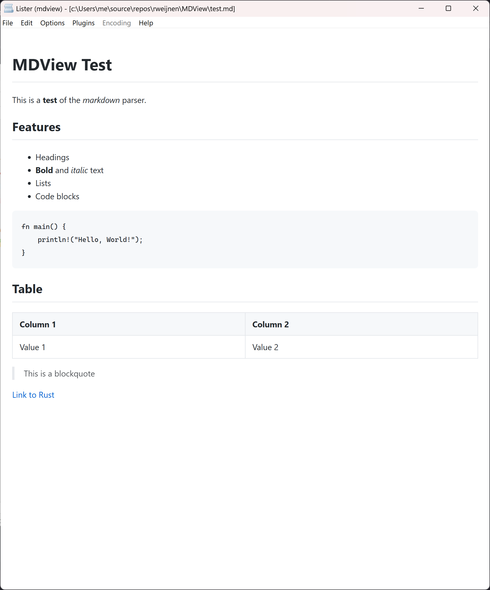
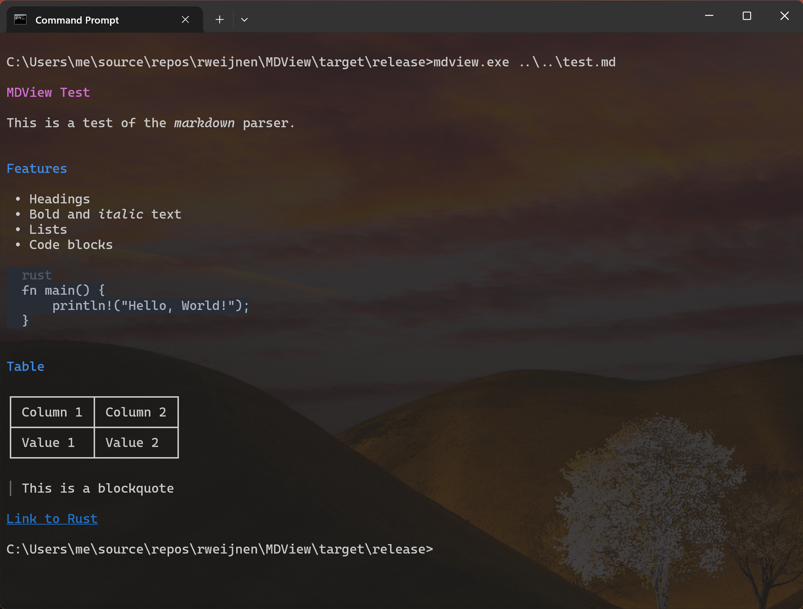
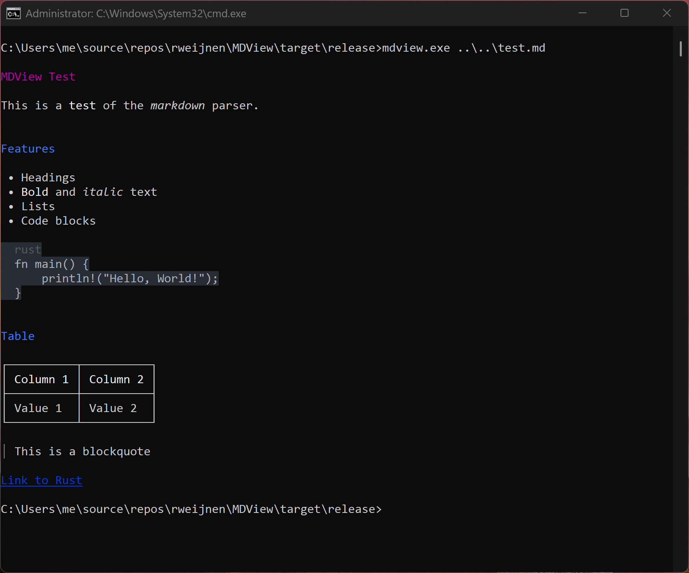

# MDView

[](https://github.com/rweijnen/MDView/actions/workflows/release.yml)

A fast, lightweight Markdown viewer for Windows. Available as a Total Commander Lister plugin and standalone executable with rich terminal output.

## Total Commander Plugin



## Features

- **WebView2 rendering** - Modern HTML rendering with full Markdown support (GUI mode)
- **Auto dark mode** - Follows Windows appearance settings (GUI mode)
- **Rich terminal output** - ANSI colors, clickable hyperlinks, unicode tables (terminal mode)
- **Ctrl+click links** - Open external links in your default browser
- **ESC to close** - Quick keyboard navigation
- **Syntax highlighting** - Code blocks with proper formatting
- **GitHub Flavored Markdown** - Tables, task lists, strikethrough, and more

## Installation

### Total Commander Plugin

1. Download the latest release ZIP
2. Open the ZIP file in Total Commander
3. Total Commander will automatically detect `pluginst.inf` and offer to install
4. Select your preferred installation directory
5. Configure file associations (`.md`, `.markdown`) in TC settings

### Standalone Executable

1. Download `mdview.exe` from the latest release
2. Place it anywhere in your PATH or desired location
3. Associate `.md` files with `mdview.exe` or run from command line

## Standalone Executable

The standalone `mdview.exe` automatically detects its environment:

- **From terminal** (cmd.exe, PowerShell, Windows Terminal): Renders markdown with ANSI formatting
- **Double-clicked** or no console: Opens GUI window with WebView2

### Windows Terminal

Full support for modern terminal features including clickable hyperlinks (OSC 8), true color, and unicode box drawing for tables.



### Legacy cmd.exe

ANSI escape processing is automatically enabled for color support in legacy consoles.



### Command Line Options

```
mdview [OPTIONS] [FILE]

Arguments:
  [FILE]  Markdown file to view (reads from stdin if not provided)

Options:
  --gui          Force GUI window mode
  --term         Force terminal output mode
  --html         Output full HTML document to stdout
  --body         Output HTML body only (no wrapper)
  --text         Output plain text (no formatting)
  --register     Register as .md file viewer (Open With)
  --unregister   Remove .md file viewer registration
  -h, --help     Show help message
```

### Examples

```bash
# Auto-detect: terminal output when run from console
mdview README.md

# Pipe content from another command
cat notes.md | mdview

# Force GUI window
mdview --gui README.md

# Output HTML for further processing
mdview --html README.md > output.html
```

### File Association

MDView can register itself as a handler for `.md` and `.markdown` files:

- **First launch (GUI mode):** MDView will offer to register as a viewer. Choose "Yes" to register and open Windows Settings where you can set it as the default. Choose "No" to be asked again next time, or "Cancel" to suppress the prompt permanently.
- **Command line:** Use `mdview --register` to register and `mdview --unregister` to remove the registration. Registration adds MDView to the "Open With" list; you then confirm the default in Windows Settings.

```bash
# Register as .md viewer and open Windows Settings
mdview --register

# Remove registration
mdview --unregister
```

### Terminal Features

| Feature | Windows Terminal | Legacy cmd.exe |
|---------|-----------------|----------------|
| ANSI colors | Yes | Yes |
| Bold/Italic | Yes | Yes |
| Clickable hyperlinks | Yes | No (text only) |
| Unicode tables | Yes | Yes |
| True color (24-bit) | Yes | Limited |

### Keyboard Shortcuts (GUI mode)

| Key | Action |
|-----|--------|
| ESC | Close viewer |
| Ctrl+Click | Open link in browser |

## Building from Source

### Prerequisites

- Rust 1.75 or later
- Windows 10/11 with WebView2 Runtime

### Build Commands

```bash
# Build release version (x64)
cargo build --release

# Build x86 version (for 32-bit Total Commander)
cargo build --release --target i686-pc-windows-msvc

# Run tests
cargo test
```

### Output Files

After building, copy the following files for distribution:

| File | Description |
|------|-------------|
| `target/release/mdview.exe` | Standalone viewer (x64) |
| `target/release/mdview_wlx.dll` | Rename to `mdview.wlx64` for TC plugin (x64) |
| `target/i686-pc-windows-msvc/release/mdview_wlx.dll` | Rename to `mdview.wlx` for TC plugin (x86) |

## Troubleshooting

### Debug Logging

If the plugin hangs or doesn't work correctly, enable debug logging:

1. Set environment variable: `set MDVIEW_DEBUG=1`
2. Start Total Commander from that command prompt
3. Try to view a markdown file
4. Check log file: `%TEMP%\mdview_debug.log`

The log shows WebView2 initialization steps and helps identify where issues occur.

### Common Issues

| Issue | Solution |
|-------|----------|
| Plugin hangs | WebView2 has a 30-second timeout; check debug log |
| Blank display | Ensure WebView2 Runtime is installed |
| F3 opens WebView search | Update to latest version (F3 now passed to TC) |

## Requirements

- Windows 10 version 1803 or later
- [WebView2 Runtime](https://developer.microsoft.com/en-us/microsoft-edge/webview2/) (usually pre-installed on Windows 10/11)

## License

This project is licensed under the Mozilla Public License 2.0 - see the [LICENSE](LICENSE) file for details.

## Author

Remko Weijnen

## Acknowledgments

- [pulldown-cmark](https://github.com/raphlinus/pulldown-cmark) - Markdown parsing
- [webview2-com](https://github.com/nicksenger/webview2-com) - WebView2 bindings for Rust
