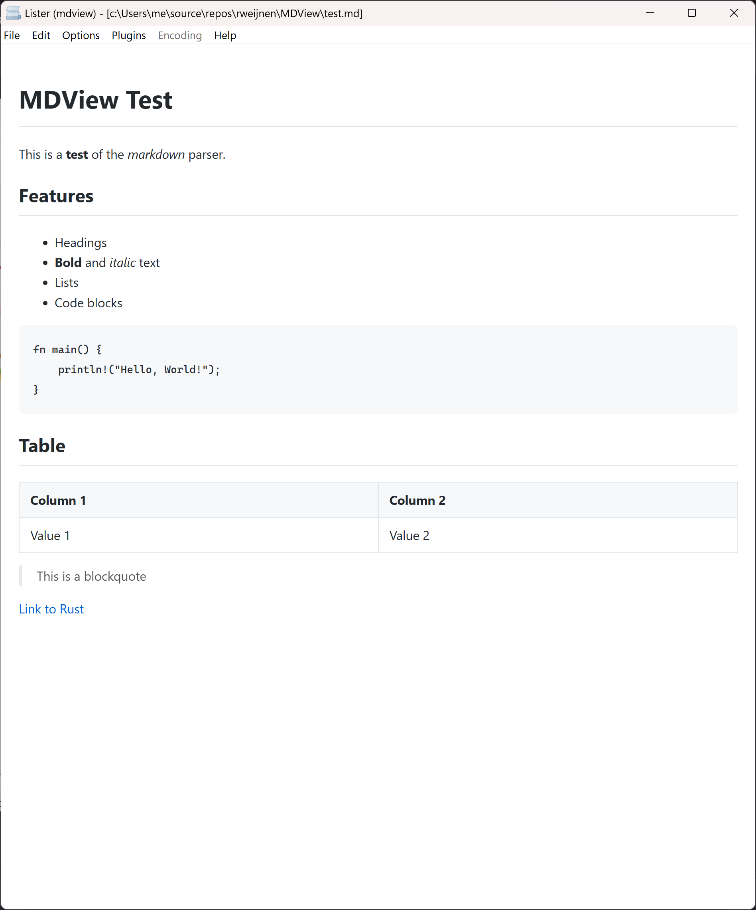

# MDView Link Test

Use this file to manually test link handling in both:
- `mdview.exe`
- Total Commander lister plugin

## External links

- [Rust website](https://www.rust-lang.org/)
- [GitHub](https://github.com/)
- [Send mail](mailto:test@example.com)

## External image link

Click the badge itself:

## Relative markdown links

- [Open second.md](second.md)
- [Open nested/third.md](nested/third.md)
- [Open file with spaces](file%20with%20spaces.md)
- [Open README.md from repo root](../../README.md)

## Relative non-markdown files

- [Open LICENSE](../../LICENSE)
- [Open screenshot image](../screenshot.png)

## Fragment links

- [Jump to Section A](#section-a)
- [Jump to Section B](#section-b)

## Mixed links with fragments

- [Open second.md#details](second.md#details)
- [Open nested/third.md#bottom](nested/third.md#bottom)

## Inline image

If local resource mapping works, this image should render:

## Section A

Some text here.

## Section B

Some more text here.
